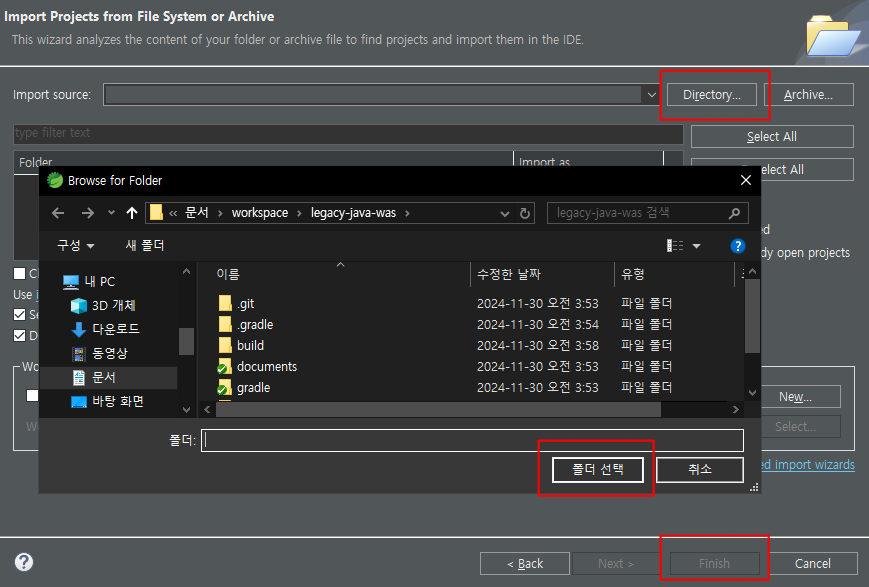

[TOC]
## 개발환경 설정 및 프로젝트 설치

### 1. 확인 및 준비사항

윈도우에서 `설정` → `시스템` → `정보` → `고급 시스템 설정` 을 클릭하여 `시스템 속성` 창을 띄운다


하단의 `환경 변수` → `새로 만들기` 버튼을 클릭하고 `변수 이름` 과 `변수 값` 에 아래 항목을 기재하여 `JAVA_HOME` 환경변수를 셋팅한다.


같은 방법으로 `PATH` 변수에 `java.exe` 파일이 위치한 경로를 추가입력해 준다.


jdk 버젼을 확인한다.

<!--[-------------------------------------------------------------------------->
```bash
> java -version

java version "1.8.0_65"
Java(TM) SE Runtime Environment (build 1.8.0_65-b17)
Java HotSpot(TM) 64-Bit Server VM (build 25.65-b01, mixed mode)
```
<!--]-------------------------------------------------------------------------->

`lombok.jar` 파일을 이클립스 (STS) 디렉토리에 복사한다.


`java -jar lombok.jar` 명령을 실행한다.

<!--[-------------------------------------------------------------------------->
```bash
> java -jar lombok.jar
```
<!--]-------------------------------------------------------------------------->

`Specify location` → `이클립스 설치위치 선택` → `실행파일 선택` → `Select` → `Install / Update` 순으로 클릭한다


### 2. 프로젝트 내려받기

`git` 을 통해 프로젝트를 내려받는다

<!--[-------------------------------------------------------------------------->
```bash
> git clone https://github.com/lupfeliz/legacy-java-was.git

Cloning into 'legacy-java-was'...
remote: Enumerating objects: 2157, done.
remote: Counting objects: 100% (175/175), done.
remote: Compressing objects: 100% (121/121), done.
remote: Total 2157 (delta 68), reused 131 (delta 45), pack-reused 1982 (from 1)
Receiving objects: 100% (2157/2157), 7.00 MiB | 9.16 MiB/s, done.
Resolving deltas: 100% (998/998), done.
```
<!--]-------------------------------------------------------------------------->

### 3. 시스템 환경변수 설정

이하 3, 4번 항목은 **폐쇄망에서 NEXUS 를 사용하는 경우**에 해당한다.

NEXUS 서버의 주소는 `192.168.0.2` 포트번호는 `8081` 이라고 가정한다. (`maven-public`, `maven-plugin` 리포지터리 사용)

윈도우에서 `설정` → `시스템` → `정보` → `고급 시스템 설정` → `시스템 속성` → `환경 변수` → `새로 만들기` 버튼을 클릭하고 `변수 이름` 과 `변수 값` 에 아래 항목을 기재하여 환경변수를 셋팅한다.

- 변수이름 : `NEXUS_MAVEN_REPO` / 변수값 : `http://192.168.0.2:8081/repository/maven-public/`
- 변수이름 : `NEXUS_PLUGIN_REPO` / 변수값 : `http://192.168.0.2:8081/repository/maven-plugins/`


또는 프로젝트 최상위 디렉토리에 `.env` 파일을 아래와 같이 생성한다

이클립스(또는 STS) 에서 사용중이라면 이클립스 실행위치에 `.env` 파일을 만들어준다

<!--[-------------------------------------------------------------------------->
```bash
NEXUS_MAVEN_REPO=http://192.168.0.2:8081/repository/maven-public/
NEXUS_PLUGIN_REPO=http://192.168.0.2:8081/repository/maven-plugins/
```
<!--]-------------------------------------------------------------------------->

### 4. gradle 설치 및 빌드

프로젝트 최상위 디렉토리 기준 `/gradle/wrapper/` 위치에 `gradle-8.2.1-bin.zip` 파일을 복사한다.

이후 의존라이브러리 다운로드를 위해 최초빌드를 커맨드 창에서 수행한다

<!--[-------------------------------------------------------------------------->
```bash
> copy gradle-8.2.1-bin.zip ./gradle/wrapper/gradle-8.2.1-bin.zip
> gradlew.bat build

> Configure project :
USE NEXUS REPOSITORY : http://192.168.0.2:8081/repository/maven-public/
================================================================================
LEGACY-JAVA-WEB APPLICATION SYSTEM
PROFILE:my / application legacy-java-was 0.0.1-SNAPSHOT
================================================================================

BUILD SUCCESSFUL in 17s
7 actionable tasks: 5 executed, 2 up-to-date
```
<!--]-------------------------------------------------------------------------->

### 5. 이클립스 (또는 Spring Tools Suit) 에서 프로젝트 불러오기

이클립스가 실행중이라면 재시작 한다.

`file` → `import` → `General` → `Projects from Folder or Archive` → `Next` → `Directory` →`폴더선택` → `Finish` 클릭




이후 빌드가 완료될 때까지 대기한다.

### 6. 구동 및 프로파일 변경

정상적으로 import / 빌드 되었다면 `Spring Dashboard` 항목 하단에 `legacy-java-was` 가 생성된다

오른쪽 버튼 클릭후 `(Re)start` 선택하면 프로젝트가 구동되며, 브라우저에서 `http://localhost:8080` 으로 결과 확인이 가능하다.


