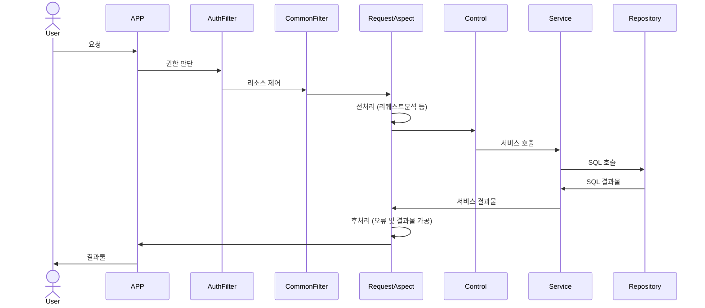
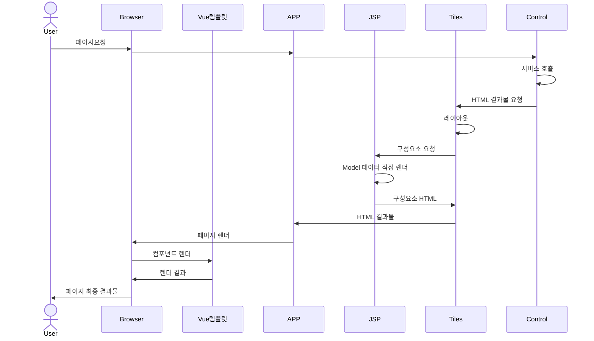

[TOC]

[← 되돌아가기](../README.md)

## 웹서비스 작성 규칙 및 유의사항

### 1. 제어흐름

- 비즈니스로직 제어흐름 (페이지 및 API 호출)

- View(JSP) 처리흐름

### 2. 일반 웹페이지 서비스

### 3. REST 서비스 (POST / GET)

### 4. 설정접근

#### 4-1. 설정 reload

### 5. DB 연동

#### 5-1. mapper 작성규칙 및 유의사항

### 6. 타서비스 연동

#### 6-1. HTTP-CLIENT 사용